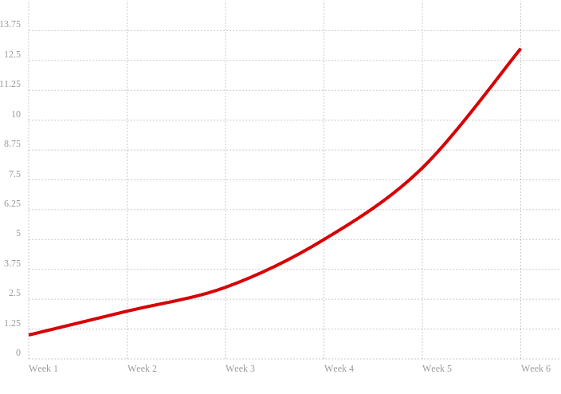
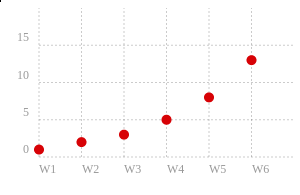

# Charts using CHARTIST.JS

Simple Responsive Charts - http://gionkunz.github.io/chartist-js

## Index

* [Setup](#setup)

## Setup

    git clone git@github.com:oren/charts.git
    cd charts
    npm install
    npm run build
    open index.html
